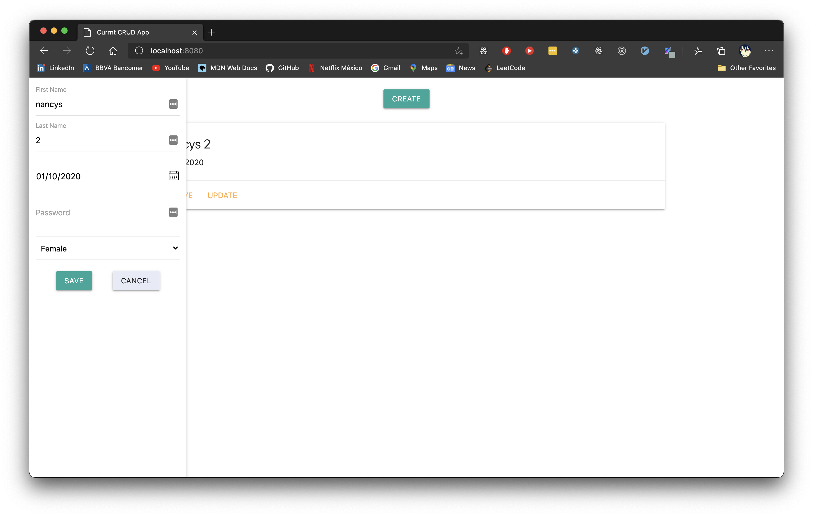
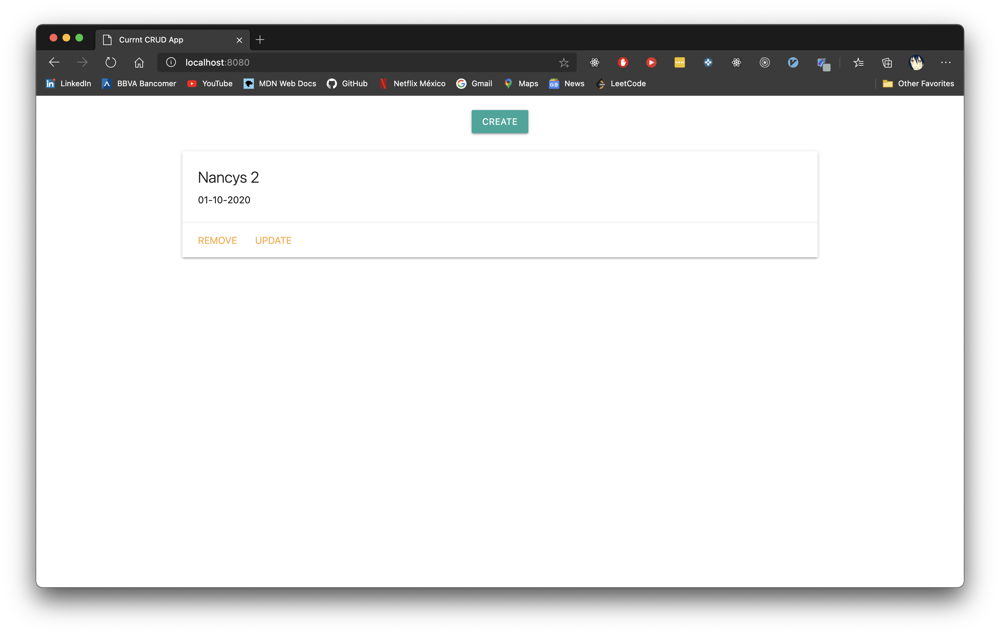

## Currnt Challenge

### React UI
[](./list.png)
[](./drawer.png)

-----------
### Materialize UI
[](./drawer-twig.png)
[](./list-twig.png)
-----------
------------
- Server runs on port 8080
- Client runs on port 3000
- DBName currnt
------------
> You need to create the database before run the proyect

Running project on client and server
```bash
    $yarn start
```

